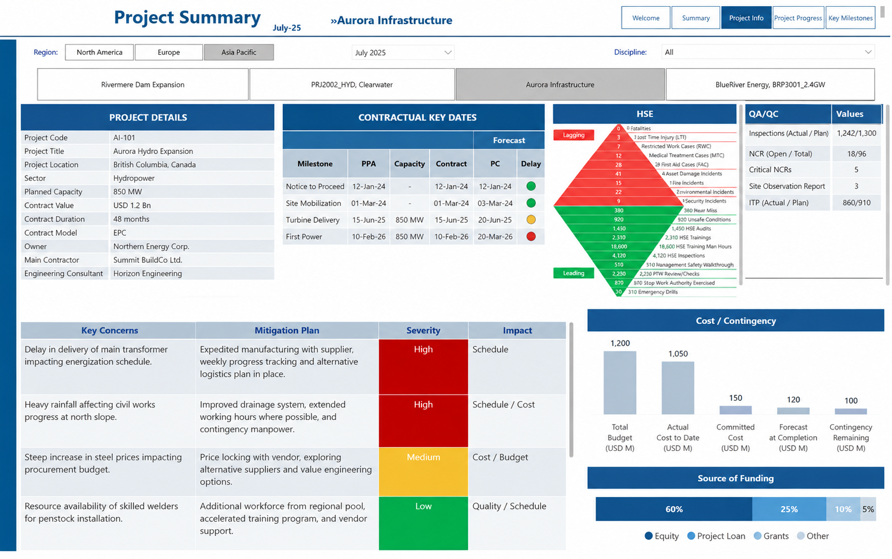
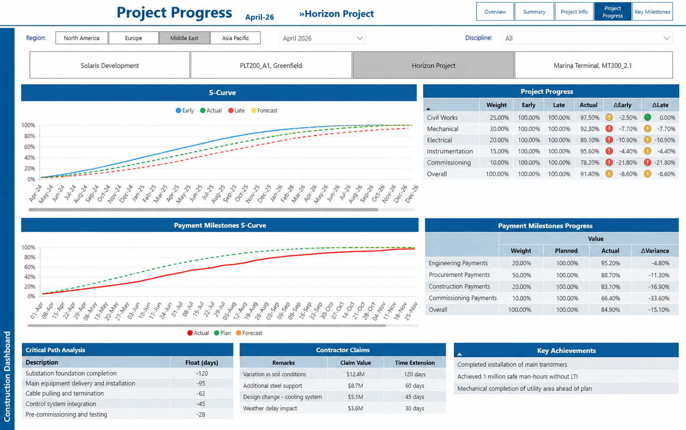
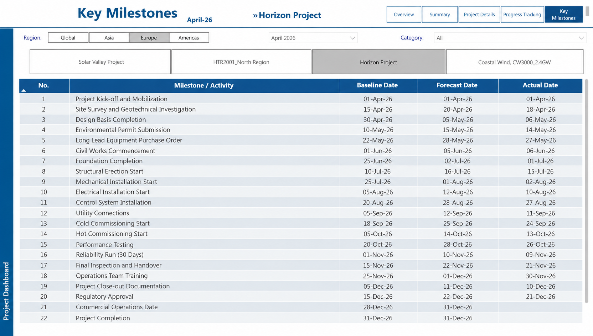

# Construction Portfolio Dashboard (Power BI)

A monthly executive dashboard for a portfolio of **utility-scale energy and water construction projects**: solar PV, wind, CSP, hydro, green hydrogen, gas-fired power and desalination. The portfolio has 40+ assets across several regions.

Each project team fills in one standard Excel template every month. The dashboard reads the whole folder, stacks the months, and gives leadership one place to review schedule, milestones, cost, risk, quality and safety across the portfolio. It replaces a monthly pack of separate project status reports.

> **Confidentiality:** this was built for a real organisation, so nothing here is the original data or file.
> The screenshots are **recreations with fictional data**, the sample workbooks are generated, and the Power Query / DAX code is a
> **generalised rewrite** of the production logic: same techniques, generic table and column names.



---

## Report pages

| Page | Question it answers | What's on it |
|---|---|---|
| **Overview** | Where are our projects? | Map of assets by region, reporting-month selector, page navigation |
| **Summary** | What did we achieve this quarter and what's coming next? | Quarterly highlights and a lookahead of upcoming milestones |
| **Project Details** | Is this project healthy? | Project fact sheet, contractual key dates with delay flags, risks and mitigations rated by severity and impact, quality counters (inspections, non-conformances, site observations), 19 safety indicators split into leading and lagging, budget vs. contingency |
| **Project Progress** | Are we on schedule, and are payments on schedule? | Progress by discipline against the early and late baselines, progress S-curve (early / late / actual / forecast), payment-milestone table and S-curve, critical path with float, contractor claims (cost and time), key achievements |
| **Key Milestones** | Which milestones slipped? | Baseline vs. forecast vs. actual date for every milestone |

**Filtering:** every page has cascading selectors (Region → Technology → Project) and a reporting-month selector, so you can compare any project month to month.



---

## How it works

```
 Monthly Excel template                 Safety system            Finance model
 (1 file per project per month)         (REST API)               (enterprise semantic model)
 <Month>/<Region>/<Project>.xlsx              │                          │
              │                               │                          │
   Power Query folder ingestion:              │                          │
   one custom function per template           │                          │
   section, applied to every file;            │                          │
   month read from the folder name            │                          │
              ▼                               ▼                          ▼
   ~14 fact tables keyed by (project file, month)   safety facts     funding & cost facts
              │
   Shared dimensions derived from the facts:
   Project · Reporting Month · Project ID mapping
```

- **Zero-touch monthly updates.** Each section of the template (project info, progress, milestones, risks, S-curves and so on) has its own Power Query function. The function runs over every file in the folder and stamps each row with the month taken from the folder name. To add a month, drop in a new folder and refresh. No query changes are needed.
- **Star-style model.** All fact tables link to two shared dimensions: **Project** and **Reporting Month**. One set of selectors therefore filters every visual on every page.
- **Composite model.** Excel data is imported. Finance figures (sources of funding, cost drivers, funding gap) come from the organisation's central finance model through DirectQuery, so the numbers match the finance team's own reporting.
- **External API.** Monthly safety indicators come from a REST endpoint and are loaded as a separate fact table.

### What each table holds

| Area | Grain | Example fields |
|---|---|---|
| Project profile | project × month | code, name, location, region, technology, capacity, contract value & type, owner, contractor, equipment supplier |
| Contractual dates | milestone | agreement date, capacity, contract date, forecast completion, delay flag |
| Risks | risk | description, mitigation, severity, impact area |
| Quality | metric | inspections, non-conformance reports (open/total), critical NCRs, site observations |
| Progress by discipline | discipline | weight, early baseline, late baseline, actual |
| Progress S-curve | month | monthly & cumulative % for early, late, actual, forecast |
| Payment milestones | package / period | weight, planned, actual, cumulative plan / actual / forecast |
| Critical path & claims | item | path, float (days), claim value, time extension, status |
| Key milestones | milestone | baseline, forecast, actual date |
| Cost & contingency | measure | budget, forecast, overrun, contingency used / remaining |
| Safety indicators | site × month × indicator | leading / lagging, indicator type, count |

### Data model

```mermaid
erDiagram
    Dim_Project ||--o{ Fact_ProjectProfile : ""
    Dim_Project ||--o{ Fact_ContractualDates : ""
    Dim_Project ||--o{ Fact_DisciplineProgress : ""
    Dim_Project ||--o{ Fact_ProgressSCurve : ""
    Dim_Project ||--o{ Fact_PaymentProgress : ""
    Dim_Project ||--o{ Fact_PaymentSCurve : ""
    Dim_Project ||--o{ Fact_Milestones : ""
    Dim_Project ||--o{ Fact_Risks : ""
    Dim_Project ||--o{ Fact_Quality : ""
    Dim_Project ||--o{ Fact_Budget : ""
    Dim_Project ||--o{ Fact_CriticalPath : ""
    Dim_Project ||--o{ Fact_Claims : ""
    Dim_Project ||--o{ Fact_Funding : "DirectQuery"
    Dim_ReportingMonth ||--o{ Fact_ProjectProfile : ""
    Dim_ReportingMonth ||--o{ Fact_DisciplineProgress : ""
    Dim_ReportingMonth ||--o{ Fact_ProgressSCurve : ""
    Dim_ReportingMonth ||--o{ Fact_Milestones : "... every fact"
    Dim_FundingHead ||--o{ Fact_Funding : ""
    Dim_Project {
        text ProjectFile PK
        text ProjectCode
        text ProjectName
        text Region
    }
    Dim_ReportingMonth {
        text Month PK
        date MonthDate
    }
    Fact_SafetyIndicators {
        date MonthDate
        text IndicatorGroup
        text IndicatorType
        int Count
    }
```



`Fact_SafetyIndicators` stands alone. Its 19 cards are each filtered to one indicator type at visual level.

### Key techniques

| Technique | Where |
|---|---|
| **Folder ingestion with a reusable function.** One `fnMonthlyFiles()` lists every workbook and derives *Month* and *Region* from the folder path. A generic `fnReadSection()` reads any template sheet. | [`power-query/01_fnMonthlyFiles.pq`](power-query/01_fnMonthlyFiles.pq), [`02_fnReadSection.pq`](power-query/02_fnReadSection.pq) |
| **Unpivoting label/value sheets** into a sortable attribute table for the project fact sheet | [`12_Fact_ProjectProfile.pq`](power-query/12_Fact_ProjectProfile.pq) |
| **Wide → long cost table**, so one chart shows budget, forecast, overrun and contingency | [`13_Fact_Budget.pq`](power-query/13_Fact_Budget.pq) |
| **REST/JSON source** with the endpoint in a parameter and credentials kept out of the query | [`14_Fact_SafetyIndicators.pq`](power-query/14_Fact_SafetyIndicators.pq) |
| **Baseline variance measures** feeding conditional-format status icons | [`dax/measures.dax`](dax/measures.dax) |
| **One measure, 19 cards:** a single safety measure reused with visual-level filters | [`dax/measures.dax`](dax/measures.dax) |
| **Funding waterfall** that closes to zero by negating the gap total with `REMOVEFILTERS` | [`dax/measures.dax`](dax/measures.dax) |
| **Composite model:** imported Excel facts alongside DirectQuery finance data | model design |

```DAX
-- Schedule variance vs. each baseline, shown per discipline with status icons
Variance vs Early = MIN(Fact_DisciplineProgress[Actual]) - MIN(Fact_DisciplineProgress[EarlyPlan]) + 0

-- Waterfall: sources of funding build up to close the funding gap
Funding Waterfall =
VAR Head = SELECTEDVALUE(Dim_FundingHead[Label])
RETURN IF(Head = "Funding Gap",
          -CALCULATE(SUM(Fact_Funding[Amount]), REMOVEFILTERS(Dim_FundingHead)),
          SUM(Fact_Funding[Amount]))
```



---

## Repository layout

```
├── README.md
├── screenshots/        recreated report pages (fictional data)
├── power-query/        M code: parameters, reusable functions, fact & dimension queries
├── dax/measures.dax    all report measures
└── sample-data/        6 fictional workbooks: <Month>/<Region>/<Project>.xlsx
```

`sample-data/` shows the monthly input template the project teams fill in: 3 projects × 2 months, every value generated.
The sheet and column names in the queries are generalised, so the queries show the logic. They aren't a drop-in loader for these files.

## Tech

Power BI Desktop · Power Query (M): folder ingestion with custom functions · DAX · composite model (import + DirectQuery) · REST API source · Excel as the data-entry layer
